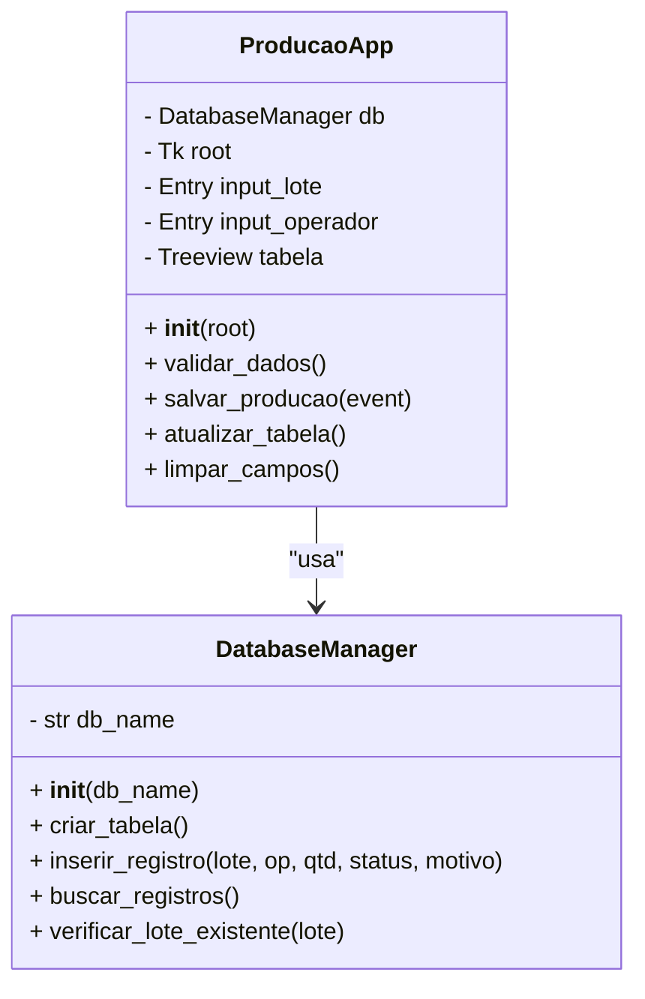

# Desafio de Projeto: Sistema "ProCheck Industrial"

## Terminal de Saída de Produção e Controle de Qualidade

### 1. Contexto do Cenário

A metalúrgica **SteelTech S.A.** está modernizando sua linha de montagem. Atualmente, o registro das peças produzidas é feito em papel, o que gera erros de contagem e atrasos na atualização do estoque.

Você foi contratado para desenvolver o **ProCheck Industrial**, um software desktop que rodará em terminais robustos (sem dependência de internet) instalados ao final da esteira de produção. O objetivo é que o operador registre cada lote finalizado, informe a qualidade e o sistema armazene esses dados localmente para posterior coleta pelo servidor central.

---

### 2. Requisitos do Sistema

#### **R01: Persistência com SQLite**

O sistema deve gerenciar um banco de dados local `logistica_producao.db` com uma tabela chamada `saida_producao` contendo:

* `id`: Chave primária autoincrementada.
* `codigo_lote`: Texto (ex: LOTE-2023-001), deve ser **único**.
* `operador`: Nome do colaborador que realizou o registro.
* `quantidade`: Valor inteiro positivo.
* `status_qualidade`: Texto ("Aprovado" ou "Reprovado").
* `motivo_rejeicao`: Texto (opcional, preenchido apenas se o status for "Reprovado").
* `data_hora`: Registro automático do momento da inserção.

#### **R02: Interface Gráfica (Tkinter)**

A interface deve ser otimizada para operação rápida:

* **Modo de Entrada:** Campos para inserir o Código do Lote, Nome do Operador, Quantidade e uma seleção (RadioButtons) para o Status de Qualidade.
* **Foco Automático:** Ao abrir o programa e após cada cadastro bem-sucedido, o cursor deve focar automaticamente no campo "Código do Lote" (para facilitar o uso de leitores de código de barras).
* **Atalho de Teclado:** O botão "Registrar" deve ser acionado tanto pelo clique quanto pela tecla `Enter` do teclado.
* **Visualização Real-time:** Uma tabela (`Treeview`) deve exibir os últimos registros feitos no terminal.

#### **R03: Regras de Negócio e Validação**

* O sistema não deve aceitar campos vazios.
* Se o usuário marcar "Reprovado", um campo de texto para a "Justificativa do Defeito" deve se tornar obrigatório.
* Tratamento de Erros: Caso o aluno tente inserir um `codigo_lote` que já existe, o sistema deve exibir um alerta de erro amigável.

---

### 3. Modelagem UML

#### **A. Diagrama de Casos de Uso**

O Operador interage com o sistema realizando três ações principais:

1. **Registrar Lote:** Insere os dados da produção.
2. **Informar Defeito:** Ação condicional caso a peça seja reprovada.
3. **Visualizar Histórico:** Consulta os registros recentes na tela.

#### **B. Diagrama de Classes**

O sistema será estruturado em duas classes principais para separar a interface da lógica de dados:

---

### 4. Entregáveis Esperados

1. **Script Python:** Arquivo único ou modularizado contendo a implementação.
2. **Banco de Dados:** O arquivo `.db` gerado após os primeiros testes.
3. **Manual Simples (Opcional):** Um parágrafo explicando como o operador deve proceder para registrar um lote reprovado.

---

### 5. Dicas de Implementação para os Alunos

* **Para o Foco Automático:** Use o método `.focus_set()` no widget do código do lote.
* **Para a Data:** Utilize `from datetime import datetime` e a função `datetime.now().strftime("%d/%m/%Y %H:%M:%S")`.
* **Para o Enter:** Use `root.bind('<Return>', self.salvar_producao)`.
* **Para o SQLite:** Lembre-se do `try-except` ao executar o `commit()` para tratar a restrição de `UNIQUE` no código do lote.

---

### 6. Sugestão de Cronograma (Tempo de Aula)

* **30 min:** Modelagem do banco e criação da classe `DatabaseManager`.
* **60 min:** Desenho do layout com Tkinter e posicionamento de widgets.
* **60 min:** Implementação das funções de salvar, validar e atualizar a tabela.
* **30 min:** Testes de estresse (campos vazios, lotes duplicados).

---

**Observação:** Este cenário é realista porque reflete a necessidade de "Edge Computing" (processamento na borda), onde o software precisa ser rápido e confiável independentemente da conexão com a nuvem, algo vital em fábricas.
